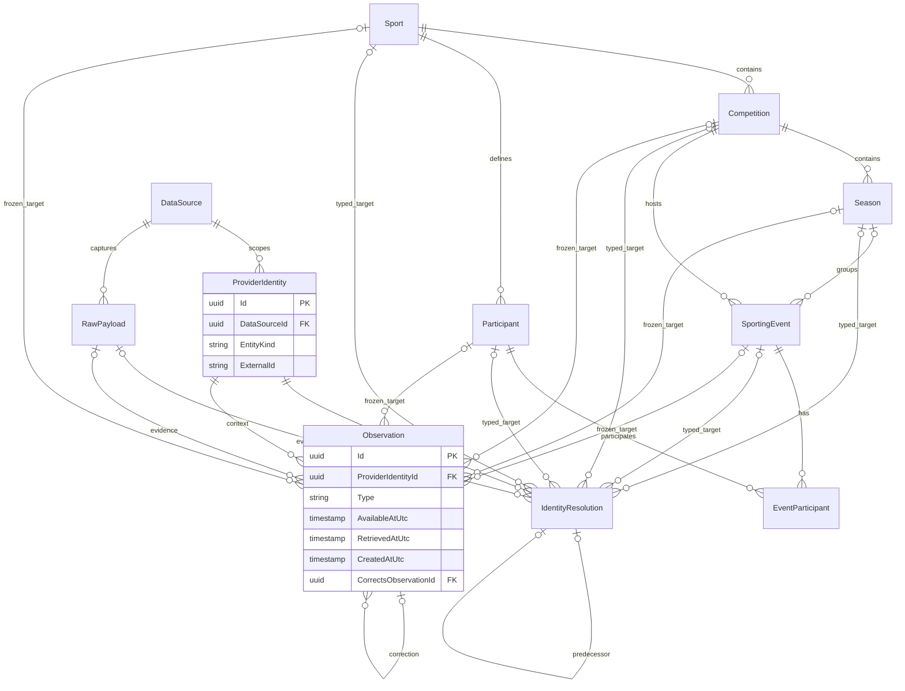

# Canonical sports and temporal observations (BS-003)

Implemented in [ADR 0015](../../adr/0015-canonical-identity-and-temporal-observations.md).
This extends the [BS-002 persistence foundation](persistence-foundation.md).
No provider client, ingestion job, statistics, feature extraction or prediction exists.

## Canonical schema

| Table | Fields and invariants |
| --- | --- |
| Sports | UUID Id, lowercase unique Code (50), DisplayName (200); four reference rows |
| Competitions | UUID Id, SportId, Name (200), nullable uppercase two-letter CountryCode, League/Tournament/Other |
| Seasons | UUID Id, CompetitionId, Name (100), nullable DateOnly StartDate/EndDate; end cannot precede start |
| Participants | UUID Id, SportId, Name (200), Team/Individual; reusable across competitions/seasons |
| SportingEvents | UUID Id, SportId, CompetitionId, nullable SeasonId/ScheduledStartUtc, Status, CreatedAtUtc |
| EventParticipants | EventId + ParticipantId key, SportId, Role, Position; positions 1/2 unique per event |

Event statuses: Scheduled, InProgress, Completed, Postponed, Cancelled.
Home/Side1 requires position 1; Away/Side2 requires position 2. Events can have
zero or one participant while incomplete, at most two; no sport-specific columns
or universal Home/Away assumption. Tennis accepts Individuals and Teams (doubles).
Composite FKs enforce matching event/competition sport, season/competition and
membership/event/participant sport. UUIDs are supplied by callers, never provider IDs.
Seed UUIDs are stable; codes are football, tennis, basketball and ice-hockey.
No competition, participant or event reference dataset is included.

## Provenance schema and identity decisions

`ProviderIdentities` uniquely anchors `(DataSourceId, EntityKind, ExternalId)`.
External IDs are case-sensitive opaque strings, maximum 500 characters; no
normalization guesses are made. Supported kinds: Sport, Competition, Season,
Participant and SportingEvent. The anchor UUID remains independent of its target.

`IdentityResolutions` is an audited ledger with ProviderIdentityId, source/kind,
Status, Version, DecidedBy, Reason, DecidedAtUtc, optional RawPayloadId and typed
target. Resolved requires exactly one target of the matching kind; Unresolved
and Ambiguous require none. Five nullable target columns carry real FKs, rather
than an unenforceable polymorphic UUID. Version 1 has no predecessor; later
versions reference the preceding identity/version/time through a composite FK.
Unique identity/version rejects stale concurrent writers; callers must reload and
explicitly reconsider evidence after a conflict. The highest version is the one
current decision; no independent active flags can disagree.

`IIdentityResolutionHistory.ReadLatestAsOfAsync` filters decision time by the UTC
cutoff before selecting the highest eligible version. `AppendAsync` saves a new
decision; competing writes surface as a persistence uniqueness failure. This port
does not match names or apply decisions to past observations.

## Observations and corrections

`Observations` stores source/provider identity, optional RawPayloadId and frozen
optional canonical target, Type, controlled value, Version and correction link.
The registry is deliberately small:

| Type | Entity kind | Value |
| --- | --- | --- |
| DisplayName | Sport, Competition, Season, Participant | Nonblank text, max 200 |
| ScheduledStart | SportingEvent | UTC timestamp |
| EventStatus | SportingEvent | SportingEventStatus enum |

Each row retains SourceEventTimeUtc (optional), SourcePublishedAtUtc (optional),
RetrievedAtUtc, AvailableAtUtc and CreatedAtUtc. Domain and CHECK constraints
reject inconsistent values/types and `AvailableAtUtc < RetrievedAtUtc` or
`CreatedAtUtc < RetrievedAtUtc`. RAW composite FKs prevent cross-source links.
Neither source event time nor publication time establishes availability.
An unresolved observation still keeps its original external context through the
immutable provider anchor. Later resolution does not rewrite it.

Corrections INSERT new rows with the same identity/type, explicit predecessor,
incremented version and availability no earlier than the predecessor. Composite
FKs enforce predecessor identity/type/version/time. Original values remain intact.
Independent source observations and correction branches remain evidence; no
automatic conflict winner or canonical projection updater is implemented.

EF guards reject update/delete of anchors, decisions and observations; PostgreSQL
statement triggers also reject UPDATE, DELETE and TRUNCATE, including bulk SQL.
All FKs use RESTRICT. Privileged administrators can disable protection; migrations
and future approved retention require a controlled privileged process. There is
no purge job or production role provisioning in this foundation.

## Historical query contract

```csharp
var query = new ObservationQuery(
    CanonicalEntityKind.Participant,
    asOfUtc,
    canonicalId: participantId,
    dataSourceId: sourceId); // source/identity filters are optional
IReadOnlyList<Observation> history = await observationHistory.ReadAsOfAsync(query);
```

`IObservationHistory` lives in Application; the scoped Infrastructure adapter
uses AsNoTracking and filters `AvailableAtUtc <= AsOfUtc` before ordering by
AvailableAtUtc, CreatedAtUtc, Id ascending. PostgreSQL UUID ordering breaks ties
deterministically. Kind/availability, identity/availability and each typed canonical
target/availability have supporting indexes. Results contain all eligible history,
including superseded rows, rather than a synthesized current winner. A canonical
filter excludes unresolved observations; source/identity filters can retrieve them.
There is no pagination yet; consumers should constrain kind/source/identity/target.

Example: a value obtained January 1 is visible January 2; its January 3 correction
is excluded from January 2 even if source publication/event times say December 31.
The January 3 query returns both rows and their correction relationship. Querying
current canonical entities or latest mapping decisions does not reconstruct history.

All new timestamps/cutoffs require UTC DateTime at microsecond precision, matching
PostgreSQL storage. Finer .NET ticks are rejected rather than silently rounded,
which preserves exact predecessor timestamp FKs. Existing BS-002 handling is unchanged.
Raw ingestion times remain independent; future ingestion must establish defensible
acquisition/availability from trusted capture evidence. No historical availability
exceptions or source-policy enforcement workflow is introduced here.

## ER diagram

Relationships show optional typed targets collectively; an observation has zero
or one target, and a resolved decision has exactly one, never all five.



## Migration and verification

`20261008001440_CanonicalSportsAndTemporalObservations` creates six canonical and
three provenance tables, four Sport rows, indexes/CHECK/FK constraints and triggers.
It only adds `(Id, DataSourceId)` uniqueness to existing RawPayloads; no ingestion
column or row is rewritten/dropped. The original InitialPersistence migration is
unchanged. Rollback drops new tables/history; review SQL and back up before any
rollback. Normal development applies forward migrations, never automatic host startup.

Run the README restore/build/test commands with Docker Linux containers. Tests
exercise fresh migration/pending-model checks, upgrade from BS-002 preserving
source/run/RAW rows, all target kinds, cross-sport relationships, duplicate identity
and slot rejection, decision conflicts, unresolved history, corrections, tie order,
UTC, SQL/EF immutability, RAW source integrity and deletion restrictions. A negative
regression excludes future-retrieved corrections with deliberately earlier source times.
Existing architecture and ingestion suites remain in CI; CodeQL is unchanged.

Next work should implement one licensed provider vertical slice with capture,
explicit normalization/resolution and contract tests. SourcePolicy, trustworthy
availability evidence, conflict interpretation and approved retention precede real
data use. Provider clients, sport statistics, prediction/features, authentication,
frontend and deployment are still planned.
