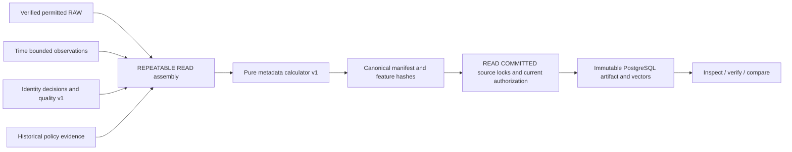

# BS-007: Reproducible dataset snapshots

The first dataset slice freezes fictional football metadata. It implements no
model training, prediction, provider network access or betting. See
[ADR 0020](../../adr/0020-dataset-snapshots-features.md).



## Definition and manifest v1

Application contracts live in `Application/Datasets`. A definition explicitly
contains football sport UUID, competition/season UUIDs and provider-neutral scope
references, inclusive season dates (at most 730 days), UTC microsecond AsOf,
HistoricalAsKnown or RetrospectiveReconstruction, explicit reconstruction time
only for the latter, quality and feature versions (1), purpose/context,
`UTC-calendar`, `eligible-observed-metadata-v1`, `fail-closed-v1`, and 1–100
target DateObservationId/prediction-cutoff pairs. Empty/unknown/ambiguous values
fail. This slice uses each target's source for observed history; cross-source
conflicts still fail through the existing quality gate. It does not merge providers.

Targets must have eligible schedule/context evidence at their prediction cutoff,
not merely at dataset AsOf. A date-only prediction cutoff is strictly before target
midnight in the explicitly asserted fictional UTC calendar. History is strictly
before the cutoff calendar day as well. No guessed kickoff or same-day order.
Target metadata may be a future scheduled date, but history never counts it.

Each artifact is compact UTF-8 canonical JSON (manifest and serializer version 1).
Object keys are ordinal sorted; arrays have explicit definition/row/evidence order;
text is NFC; nulls are explicit; timestamps are `yyyy-MM-ddTHH:mm:ss.ffffffZ`;
numbers are invariant integers. Manifest SHA-256 hashes exact bytes. It excludes
build execution IDs and times. Frozen records contain observation values and
availability, RAW hash/receipt, provider anchors, decisions, quality assessments,
policy versions/permissions and known audit decisions. Scope/participants come
from verified RAW plus historical decisions, never current canonical projections.
Separate status RAW is retained when a date correction reuses earlier status.

Rows contain target context, sorted eligible history, sorted exclusion diagnostics,
ordered vector/missing reasons and a feature hash. The feature artifact hash covers
its target/history inputs as well as calculated values. Definition fingerprint
identifies the request; content hash establishes exact evidence identity. A later
correction or interpretation produces different immutable content. Serializer or
calculator semantics changes need new versions and explicit support.

## Feature catalog

Schema 1 has four nullable integer features in stable order:

| Name | Units | Window | Meaning |
|---|---|---|---|
| away_days_since_last_observed_completed_match | calendar days | explicit season | Age of latest supported *observed* completion |
| away_observed_completed_matches_last_30d | observed matches | preceding 30 calendar days | Lower bound from supported observations |
| home_days_since_last_observed_completed_match | calendar days | explicit season | Same for home participant |
| home_observed_completed_matches_last_30d | observed matches | preceding 30 calendar days | Same for home participant |

They require date, completed-status, identity, RAW, quality and policy evidence.
They are partial-history metadata, not total match counts or actual rest duration.
Missing status returns `historical_status_missing`; absent supported completion
returns `observed_history_missing`. Neither becomes zero. Cancelled, scheduled,
future, same-day and target events are excluded from completed history. Duplicate
canonical events count once; contradictory context fails rather than choosing a winner.
Complete season counts/rest need coverage evidence beyond BS-007.

## Consistency, authorization and lifecycle

REPEATABLE READ freezes committed rows visible to assembly, including the BS-006
gate's interpretation. Both observation availability and recording, RAW receipt,
and decision/quality/policy knowledge limits apply per target. Historical mode
never uses a later review; retrospective retains original observation/RAW limits
and records interpretation bounded by explicit reconstruction time. INSERT recording
is not COMMIT time: a newly committed backdated transaction can change a reissued
query, but cannot change an existing artifact.

After assembly closes, finalization takes a content advisory lock, attempt lock,
then sorted source locks under READ COMMITTED. These source locks are shared with
ingestion, review and policy audits. Current enablement, purpose/context,
analytics, retention and RAW retention age are rechecked before publication.
No filesystem I/O occurs while these locks are held. Revocation committed before
finalization denies publication; one committed after publication denies later use.
No authorization retry is attempted. Current permission never follows from a hash.

Each attempt has append-only Requested, Running and Succeeded/Failed/Cancelled
records with operator/reason. Snapshot/vector/audit INSERT recording time is
assigned by PostgreSQL; SQL UPDATE, DELETE, TRUNCATE and EF bulk changes fail.
Ordinary runtime roles must not own tables/triggers (ADR 0017); owners can bypass.
Unique manifest hash plus advisory serialization makes concurrent identical builds
reuse one snapshot while retaining separate attempt ledgers. PostgreSQL stores
artifact bytes and vectors in the same transaction: write failure publishes neither.
Bounds: 100 targets, 1,000 candidate observations per target, 16 MiB artifact,
200 differences per comparison page, 500 characters per value (larger values use
length + SHA-256), 100,000 comparison differences with overflow failure.

## Explicit development commands

Use only a manually migrated disposable PostgreSQL 17 database. Configure
`ConnectionStrings__BetStats` locally and `Ingestion__RawStoragePath` to an absolute
private directory outside the repository. No credentials belong in source control.
Migration is manual; Worker never migrates or ingests on ordinary startup.

```sh
dotnet ef database update --project src/BetStats.Infrastructure
dotnet run --project src/BetStats.Worker --configuration Release --no-build -- \
  --Dataset:Action=build-synthetic --Dataset:ApproveSynthetic=true \
  --Dataset:SourceCode=synthetic-dataset-demo --Dataset:TargetDate=2026-12-01 \
  --Dataset:OperatorId=operator:local --Dataset:Reason=Fictional-demo \
  --Logging:LogLevel:Default=Warning
```

The target date must be a future date in the fictional 2026 season. Setup creates
reviewed scheduled target/unknown-status events and a separate project-owned
fixture source, then imports three January completions, one unknown status and
a same-day event. It grants only the fixture purposes; it never approves a real
provider. The demo explicitly captures current DB time as dataset/prediction cutoffs
after publication and returns AttemptId, SnapshotId and ManifestHash. Repeating
the demo captures a new cutoff, so definition/hash may differ. Repeat the same
Application definition to demonstrate exact idempotency (integration tests).
The unknown-status fixture yields missing features, not invented zero activity.

```sh
dotnet run --project src/BetStats.Worker -c Release --no-build -- --Dataset:Action=inspect --Dataset:SnapshotId=<uuid> --Logging:LogLevel:Default=Warning
dotnet run --project src/BetStats.Worker -c Release --no-build -- --Dataset:Action=verify --Dataset:SnapshotId=<uuid> --Logging:LogLevel:Default=Warning
dotnet run --project src/BetStats.Worker -c Release --no-build -- --Dataset:Action=compare --Dataset:LeftId=<uuid> --Dataset:RightId=<uuid> --Dataset:Offset=0 --Dataset:Limit=20 --Logging:LogLevel:Default=Warning
```

Inspect/compare authorize before returning content. Verification reports separately
artifact integrity, evidence completeness, present permission and feature
recalculation. On denial it does not inspect evidence and returns an explicit reason;
the immutable bytes can still have valid integrity. Verification never rewrites a
snapshot. Comparison reports stable paths for definition/cutoff/mode, rows,
inclusions/exclusions, quality, frozen evidence and feature changes. Advance Offset
by the number returned; Total describes that immutable comparison.

## Database and artifact inspection

Use an authorized disposable connection and bound queries:

```sql
SELECT "Id", "ManifestHash", "DefinitionFingerprint", "RowCount", "RecordedAtUtc"
FROM datasets."Snapshots" ORDER BY "RecordedAtUtc", "Id" LIMIT 20;
SELECT "AttemptId", "Sequence", "Status", "FailureCode", "SnapshotId"
FROM datasets."BuildEvents" ORDER BY "RecordedAtUtc", "Id" LIMIT 50;
SELECT convert_from("Content", 'UTF8')::jsonb
FROM datasets."Snapshots" WHERE "Id" = '<snapshot-uuid>';
SELECT "EventId", "PredictionCutoffUtc", "Fingerprint", convert_from("Content", 'UTF8')::jsonb
FROM datasets."Features" WHERE "DatasetId" = '<snapshot-uuid>' ORDER BY "EventId", "PredictionCutoffUtc";
```

SQL owner access does not automatically grant source usage rights. Prefer authorized
Worker inspect/verify over copying bytes to new storage.

## Failure recovery and leakage examples

Cancellation writes Cancelled and commits no artifact. DB failure can also prevent
terminal auditing; the durable Requested/Running entry then remains. First confirm
the owning process stopped, then explicitly close that attempt:

```sh
dotnet run --project src/BetStats.Worker -c Release --no-build -- --Dataset:Action=interrupt --Dataset:AttemptId=<uuid> --Dataset:OperatorId=operator:local --Dataset:Reason=Owner-confirmed-stopped
```

Closure is idempotent and cannot turn an already terminal attempt into another state.
This is manual recovery, not distributed lease ownership. Submit a new explicit
request after fixing storage/evidence; never edit old artifacts or retry denials blindly.

An observation claiming January event time but inserted after T is excluded at T.
A later participant mapping cannot improve HistoricalAsKnown; reconstruction must
name a later boundary and remains labeled. A corrected target date creates a new
snapshot. A same-day completion has no known ordering and cannot count as prior.
Missing completed-status evidence is unavailable. Revocation during REPEATABLE READ
must be caught in finalization's fresh view. Corruption cannot be repaired in place:
verification rejects it and recovery requires a new validated build.

## Verification and next scope

Run restore, Release build, all tests and `dotnet ef migrations has-pending-model-changes
--project src/BetStats.Infrastructure`. PostgreSQL 17 Testcontainers tests require
Docker; absence is a failure, never a silent skip. Tests cover fresh migration,
BS-006 upgrade, previous history, deterministic serialization/calculation,
temporal/reconstruction gates, repeat/concurrent builds, direct/bulk mutation,
revocation, corrupt RAW/artifact, interruption and comparison. Synthetic fixtures
have no external network requests. No model has been trained or validated.

Recommended BS-008: governed coverage evidence, precise event-time provenance and
permission-aware evaluation contracts before complete activity features/backtesting.
