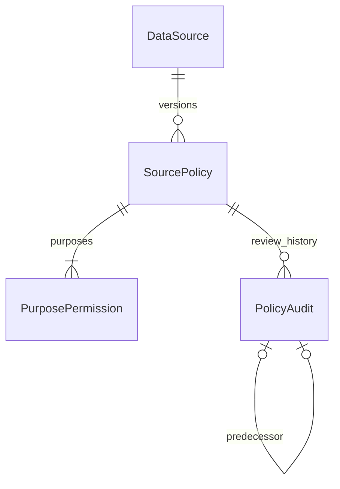

# Source governance and provider foundation (BS-004)

[ADR 0016](../../adr/0016-source-governance-and-bounded-history.md) governs this
milestone. No provider permission, real dataset, client, credential or license is
included. This foundation checks recorded internal decisions; it cannot establish
contractual rights by itself.
BS-005 uses this foundation for synthetic ingestion only; no real candidate policy
is approved. See [candidate assessment](football-data-assessment.md) and
[stage-specific gates](first-football-ingestion.md).

## Four distinct questions

1. Technical access: can a file or API be reached?
2. Internal approval: has BetStats reviewed evidence and approved the proposed use?
3. Contractual/licensing permission: does the actual rights holder permit that use?
4. Output rights: may data or derived outputs be displayed, trained on, redistributed
   or commercialized under those verified terms?

A successful download answers only the first question. PolicyStatus.Approved is
an internal review state, not a provider grant or legal opinion. An Allowed purpose
records the reviewer's evidence-based conclusion; provider-specific terms and output
rights must be verified separately before enabling ingestion. Unknown means denied.
Store opaque evidence/terms references, not copyrighted documents, signed URLs,
credentials, API keys or private correspondence. References must resolve within an
appropriately controlled evidence process; this task does not implement that process.

## Policy schema and lifecycle

| Table in governance | Meaning |
| --- | --- |
| SourcePolicies | Immutable UUID Id, DataSourceId, positive Version, EffectiveFromUtc/optional EffectiveToUtc, TermsReference, EvidenceReference, CreatedAtUtc, database RecordedAtUtc |
| PurposePermissions | SourcePolicyId/Purpose key, Allowed/Denied/Unknown, optional required attribution text and positive maximum retention days |
| PolicyAudits | Immutable approval/revocation decisions: UUID Id, policy, sequence, predecessor, Status, reviewer identifier, reason, ReviewedAtUtc, optional ApprovedAtUtc, database RecordedAtUtc |

Draft is the initial state with no audit decision. SourcePolicy exposes derived
Status, ReviewedAtUtc, ApprovedAtUtc and Reviewer from its loaded audit collection.
Approval is sequence 1; revocation references that approval as sequence 2. A revoked
version cannot be revived: create a new version, with new evidence and review.
Load Permissions/Audit when editing this aggregate; the history adapter does so.
Never interpret a partially loaded aggregate as an authoritative approval.

The nine independent purposes are MetadataDiscovery, DataRetrieval, RawPayloadStorage,
HistoricalRetention, InternalAnalytics, PublicDisplay, ModelTraining, CommercialUse
and Redistribution. Missing constructor entries become Unknown. Approval requires all
nine stored rows, which still may be Unknown or Denied. Definition and permissions
are saved as a draft before appending approval; approval and immutable history are
then saved separately. The approval trigger checks the persisted definition.

Unique source/version and policy/sequence enforce concurrency. All FKs RESTRICT.
Source policies, permissions and audits reject EF update/delete and SQL
UPDATE/DELETE/TRUNCATE. Permissions cannot be appended after audit begins.
Approval locks the source and rejects overlap with any currently approved version
using half-open [from,to) intervals. Revoke an old approval before approving a
replacement with an overlapping interval; history stays intact. Adjacent intervals
are allowed. Writers use READ COMMITTED or SERIALIZABLE; other isolation levels
are rejected because a stale snapshot could hide concurrent approvals.

## Fail-closed evaluation

`ISourcePolicyEvaluator.EvaluateAsync(sourceId, purpose, evaluationUtc, context, token)`
returns Allowed, reason, policy UUID/version when available, evaluation time and
restrictions. Missing policy, Draft, Revoked, outside effective interval, Unknown,
Denied and multiple active Approved policies all deny. Internal approval never
overrides permission values. Infrastructure reads only database-available versions
and audit decisions at the cutoff; future approval event times are also excluded.

UsageContext may additionally require PublicDisplay, CommercialUse, ModelTraining
or Redistribution even when the primary purpose is retrieval. These permissions
are independently checked. AttributionProvided and IntendedRetentionDays must
satisfy every applicable restriction. These are caller declarations: future display,
storage and execution code must actually implement and audit them. Returned
restrictions do not magically add attribution or delete retained data.

The evaluation port is reusable for future ingestion, storage, training and output
operations. There are no endpoints, source-policy administration UI or real provider
operations yet. Individual authorization/operation audit records and revocation
coordination for long-running jobs are BS-005-or-later work. Recheck policy at each
operation; an earlier evaluation is not a permanent authorization token.

## Provider contracts and budgets

Application owns IProviderAdapter, ProviderDescriptor (source/code, canonical sport
UUIDs, supported capabilities), ProviderRequest, configuration validation and
structured errors. Initial capabilities: MetadataDiscovery, EventMetadata and
HistoricalObservations. Metadata discovery requires its purpose; the other two
require DataRetrieval. No provider SDK or HTTP-specific DTO enters Domain.
The initial execution result is status/error only; BS-005 should add the smallest
typed data contract required by its licensed vertical slice.

AuthorizedProviderExecutor validates capability/configuration, evaluates policy,
checks current operational source status before policy and again before acquiring
the supplied shared budget, then invokes the adapter with cancellation (BS-004.1).
Missing/disabled sources deny independently of historical licensing rights.
Policy denial never invokes ExecuteAsync. Configuration validation must be local;
it cannot contact providers before authorization. Adapters must classify errors
without exposing credentials or unrestricted response text: authentication failure,
rate limit, temporary unavailability, invalid response, permission denied,
unsupported capability, invalid configuration, exhausted budget and timeout.
There are no automatic retries, including auth/authorization failures.

RequestBudgetConfiguration requires positive requests/minute, requests/day and
concurrency; timeout must be greater than zero and at most five minutes. RequestBudget
uses a monotonic TimeProvider for sliding 60-second/24-hour windows, synchronized
concurrency leases and a shared Retry-After cooldown (delay or HTTP-date instant).
Shorter cooldowns cannot erase a longer one. Acquisition fails immediately when
exhausted. Requests already acquired count even when execution fails.

Create one budget per provider, shared by all its callers in the process, not a
fresh budget per request. No singleton registry for nonexistent providers is added.
Budgets reset on restart and do not coordinate multiple application instances.
No distributed limiter is introduced. Adapters must honor cancellation; if one
ignores timeout/cancellation, its concurrency lease remains occupied until it
finishes, preventing runaway overlap. Fake adapters/manual clocks test these rules
without HTTP requests or real waits.

## Trusted identity availability

DecidedAtUtc remains the caller's decision event time. IdentityResolution.RecordedAtUtc
is assigned by PostgreSQL clock_timestamp(), overwriting any supplied insert value;
EF treats it as generated. Historical reads require both times <= AsOfUtc, then
select the highest eligible version. Backdated decisions and later corrections
cannot become visible at earlier cutoffs. Existing decision fields/rows are preserved.

BS-003 had no trusted receipt timestamp, so its original availability cannot be
reconstructed. Migration adds the column and conservatively assigns database
migration time to old rows; pre-migration cutoffs exclude them. This is an intentional
historical behavior change. PostgreSQL may physically rewrite the table to backfill
the volatile default; review migration timing/locking before applying at scale.
No guessed original time or caller historical availability is trusted.

RecordedAtUtc is database insert time, not commit time. A long transaction committing
later may make a row visible to repeated historical queries after the fact. Database
clock correctness and ordinary privileges are trusted; administrators can disable
triggers. No transaction-commit timestamp infrastructure is implemented.
BS-004.1 also adds trusted observation recording and RAW temporal-link validation;
see [audit remediation and retention](audit-remediation.md). Capture timestamps
remain separate from database recording evidence.

## Bounded observation history

Use `ReadPageAsOfAsync(query, pageSize, cursor, token)`. History:MaximumPageSize
(environment `History__MaximumPageSize`) configures the cap: default 200, allowed
1–1000. The adapter takes only pageSize+1 rows to detect a next page. Ordering and
cursor keys are AvailableAtUtc, CreatedAtUtc, Id ascending, using PostgreSQL tuple
comparison. Every page reapplies AvailableAtUtc <= AsOfUtc, RecordedAtUtc <= AsOfUtc
and all query filters.
Cursors carry the complete original query; changing kind, source, identity,
canonical target or cutoff is rejected. Keys require UTC microsecond precision,
nonempty UUID and availability within the cutoff. They are application value
objects, not signed public API tokens; no HTTP cursor encoding is introduced.

ReadAsOfAsync remains compatible for results within the cap; it throws on overflow
and directs consumers to pagination. It never loads an unbounded list or silently
truncates. No offset scanning is used. Identical timestamps are broken by UUID,
so unchanged rows are neither duplicated nor omitted across pages.
Pages are not a transaction snapshot: a newly inserted backdated observation behind
the cursor can be missed, while one ahead can appear on a later page. Use a controlled
repeatable snapshot/export in future workflows requiring a frozen dataset.

## Migration, verification and next slice

20261008005300_SourceGovernanceAndTrustedHistory adds three governance tables,
constraints/indexes/triggers and the generated identity availability column/index.
It does not replace BS-002/003 migrations or delete ingestion/canonical/provenance
history. Rollback drops the new governance history and trusted availability column;
review SQL and back up before any deliberate rollback. Hosts never migrate automatically.
Fresh/upgrade Testcontainers tests preserve prior RAW/observation/identity
data; pending-model checks verify mappings match migrations. Tests cover fail-closed
evaluation, permissions, audit, overlapping/concurrent approvals, immutability,
trusted availability, pagination ties/empty/invalid cursors and timeout/budget behavior.
Existing CI runs every suite; CodeQL remains unchanged.

Recommended BS-005: one independently verified provider/sport/capability, local
configuration validation, shared budget, immediate authorization checks, permitted
RAW capture, explicit typed normalization, trusted availability and contract tests.
Verify rights for each operation and derived output before enabling it. Provider
clients/downloads, sports statistics, fuzzy identity resolution, predictions,
training, authentication, UI, billing and production deployment remain out of scope.
