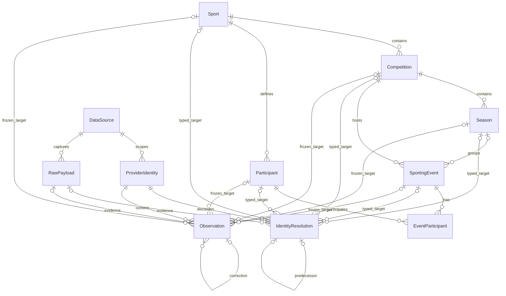

# Model kanoniczny i obserwacje czasowe (BS-003)

Decyzje opisuje [ADR 0015](../../adr/0015-canonical-identity-and-temporal-observations.md).
Rozszerza to [fundament BS-002](persistence-foundation.md).

## Zaimplementowany model

Schemat `canonical` zawiera Sport, Competition, Season, Participant,
SportingEvent i EventParticipant. Każda encja ma własny UUID; uczestnictwo ma
klucz EventId/ParticipantId i unikalną pozycję 1 lub 2. Home/Side1 odpowiada
pozycji 1, Away/Side2 pozycji 2. Nie wymuszamy Home/Away dla wszystkich sportów.
Uczestnicy Team/Individual są współdzieleni między rozgrywkami i sezonami;
tenis obsługuje także drużyny. Nie ma kolumn statystyk konkretnych sportów.

Competition ma SportId, nazwę, opcjonalny dwuliterowy kod kraju (wielkie litery)
i typ League/Tournament/Other. Season ma CompetitionId, nazwę oraz opcjonalne
daty DateOnly; koniec nie może poprzedzać początku. SportingEvent ma SportId,
CompetitionId, opcjonalny SeasonId i termin UTC, Status oraz CreatedAtUtc.
Statusy: Scheduled, InProgress, Completed, Postponed, Cancelled. Złożone FK
weryfikują sport rozgrywki/wydarzenia/uczestnika oraz rozgrywkę sezonu.
Niekompletne wydarzenie może mieć 0–1 uczestników; maksymalnie ma dwóch.
Migracja wprowadza wyłącznie cztery sporty referencyjne ze stałymi UUID i kodami
football, tennis, basketball, ice-hockey. Pozostałe dane testowe są syntetyczne.

## Tożsamość i provenance

`provenance.ProviderIdentities` ma unikalny klucz źródło/rodzaj/ExternalId.
Obsługuje Sport, Competition, Season, Participant i SportingEvent. ExternalId
jest nieinterpretowanym ciągiem rozróżniającym wielkość liter (maks. 500),
oddzielonym od UUID kanonicznego. Nie dodano fuzzy matching ani zgadywania.

`IdentityResolutions` przechowuje jawne decyzje, aktora, uzasadnienie, czas UTC,
opcjonalny RAW i wersję. Resolved wymaga jednego celu zgodnego rodzaju;
Unresolved/Ambiguous nie mogą wskazywać celu. Pięć opcjonalnych kolumn celu
ma rzeczywiste FK. Kolejna wersja odwołuje się do poprzedniej decyzji tego
samego identyfikatora wraz z wersją/czasem. Unikalność identity/version blokuje
konkurencyjne gałęzie; po konflikcie trzeba ponownie odczytać stan i ocenić dowody.
Najwyższa wersja jest jedyną bieżącą decyzją. Kontrakt Application
`IIdentityResolutionHistory` dopisuje decyzje i odczytuje ostatnią dopuszczalną
według DecidedAtUtc i zaufanego czasu DB RecordedAtUtc/AsOfUtc (BS-004).
Stare decyzje mają konserwatywną dostępność z czasu migracji.
Nie aktualizuje wcześniejszych obserwacji.

## Obserwacje i czas

`provenance.Observations` zachowuje źródło, provider identity, opcjonalny RAW,
opcjonalny utrwalony cel kanoniczny, typ i kontrolowaną wartość. Rejestr:

| Typ | Rodzaj encji | Wartość |
| --- | --- | --- |
| DisplayName | Sport, Competition, Season, Participant | Niepusty tekst do 200 znaków |
| ScheduledStart | SportingEvent | Termin UTC |
| EventStatus | SportingEvent | Enum SportingEventStatus |
| EventDate (BS-005) | SportingEvent | DateOnly, bez odgadywania kickoffu UTC |

Każdy rekord rozdziela opcjonalne SourceEventTimeUtc i SourcePublishedAtUtc od
RetrievedAtUtc, AvailableAtUtc, CreatedAtUtc i zaufanego RecordedAtUtc DB (BS-004.1).
Dostępność i utworzenie nie mogą
poprzedzać pobrania. Czas wydarzenia/publikacji nie oznacza dostępności.
Wspólne FK RAW/źródło blokują odwołanie do payloadu innego źródła.
Korekta jest nowym rekordem: ten sam identity/typ, poprzednik, kolejna wersja
i brak cofania dostępności. Oryginał nie zmienia się. Niezależne obserwacje oraz
gałęzie korekt pozostają dowodami; nie ma automatycznego wyboru zwycięzcy.

EF blokuje update/delete historii, a triggery PostgreSQL blokują także UPDATE,
DELETE i TRUNCATE przez zbiorczy lub bezpośredni SQL. FK mają RESTRICT.
Administrator może wyłączyć triggery; zatwierdzona retencja i produkcyjne role
wymagają przyszłego kontrolowanego procesu. Nie ma automatycznego purge.

`IObservationHistory.ReadAsOfAsync(new ObservationQuery(kind, asOfUtc,
canonicalId, dataSourceId, providerIdentityId))` zwraca całą dopuszczalną historię.
Opcjonalne filtry ograniczają zakres. Adapter Infrastructure używa AsNoTracking,
najpierw `AvailableAtUtc <= AsOfUtc` i `RecordedAtUtc <= AsOfUtc`, potem sortowania AvailableAtUtc,
CreatedAtUtc, UUID rosnąco. Indeksy obejmują kind/identity/cele i dostępność.
Filtr canonicalId wyklucza unresolved; filtr source/identity pozwala je odczytać.
BS-004 dodaje paginację keyset przez ReadPageAsOfAsync; domyślny limit 200 jest
konfigurowalny, a stary odczyt listy zgłasza błąd przy przekroczeniu.
Nie ma projekcji wybierającej najnowszy wynik. Szczegóły:
[paginacja i zaufana dostępność](source-governance.md).

Przykład: rekord pobrany i zapisany w DB 1 stycznia jest widoczny 2 stycznia; korekta pobrana
3 stycznia nie jest widoczna 2 stycznia nawet przy czasie źródłowym 31 grudnia.
Zapytanie z 3 stycznia zwraca oba rekordy i relację korekty. Nie łączymy historii
z bieżącym stanem encji lub najnowszym mapowaniem. Późniejsza decyzja nie
przemapowuje wcześniejszych unresolved. Encje kanoniczne nie rekonstruują historii.

Nowe czasy i cutoff wymagają DateTime UTC z precyzją mikrosekund PostgreSQL.
Drobniejsze ticki są odrzucane, aby nie zaokrąglać czasu w kluczach poprzedników.
Dotychczasowa walidacja BS-002 pozostaje zachowana. Przyszłe ingestion musi
ustalać defensywną dostępność na podstawie zaufanych dowodów pobrania.
Zobacz [BS-004.1: zapis DB, stare dane i reprocessing RAW](audit-remediation.md).

## ER

Relacje celów są alternatywami: obserwacja ma 0–1 celów, decyzja Resolved
dokładnie jeden zgodnego rodzaju. Nigdy nie wskazują wszystkich pięciu.
Szczegółowe pola zawiera [angielski model danych](../../en/data/canonical-sports-model.md).

## Migracja i ograniczenia

`20261008001440_CanonicalSportsAndTemporalObservations` dodaje sześć tabel
canonical, trzy provenance, sporty, constraints, indeksy i triggery. W ingestion
dodaje tylko unikalność RawPayloads(Id, DataSourceId), bez zmiany danych/kolumn.
Migracja InitialPersistence pozostaje niezmieniona. Rollback usuwa nową historię;
wymaga przeglądu SQL i kopii danych. Host nie uruchamia migracji automatycznie.

Polecenia restore/build/test z README wymagają Docker z kontenerami Linux.
Testcontainers weryfikuje świeżą bazę, pending-model, upgrade BS-002 zachowujący
źródło/run/RAW, FK, unikalność, korekty, immutable, UTC i remisy czasu.
Negatywny test wyklucza przyszłe korekty mimo wcześniejszych czasów źródłowych.
Istniejące testy ingestion/architektury i CodeQL pozostają w CI.

Brak providerów, ingestion jobs, statystyk, feature engineering, predykcji,
uwierzytelniania, UI i deploymentu. Kolejny krok to jeden dozwolony provider
z RAW capture, jawną normalizacją/rezolucją i testami kontraktu. Przed realnymi
danymi trzeba ustalić SourcePolicy, prawa użycia, zaufaną dostępność,
interpretację konfliktów i audytowaną retencję.
