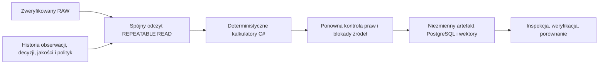

# BS-007: Niezmienne zbiory danych i cechy metadanych

Zadanie zamraża fikcyjne metadane piłkarskie. Nie trenuje modelu ani nie pobiera
danych zewnętrznych. Szczegóły kontraktów zawiera
[dokumentacja angielska](../../en/data/dataset-snapshots-features.md) oraz
[ADR 0020](../../adr/0020-dataset-snapshots-features.md).



Definicja wskazuje dyscyplinę, rozgrywki/sezon, jawne daty sezonu, AsOfUtc,
tryb, czas rekonstrukcji, wersję jakości i cech, cel wykorzystania oraz osobny
cutoff przewidywania dla każdej obserwacji docelowej. Daty bez godzin wymagają
jawnej fikcyjnej interpretacji `UTC-calendar`; cutoff jest przed dniem zdarzenia.
Historia również musi być sprzed dnia cutoff. Nie zgadujemy godzin rozpoczęcia.
Każdy cel korzysta z historii własnego źródła; konflikty innych źródeł nadal
blokuje istniejąca bramka jakości.

HistoricalAsKnown respektuje czas dostępności i zapisu obserwacji, zapis RAW oraz
wiedzę o tożsamości/jakości/politykach w chwili cutoff. RetrospectiveReconstruction
pozwala na późniejszą interpretację tylko do jawnego czasu rekonstrukcji,
zachowuje granice historycznych obserwacji/RAW i jest osobno oznaczone.
INSERT nie jest COMMIT. Artefakt utrwala dokładnie dane widoczne w transakcji;
późniejsze korekty i późno zatwierdzone transakcje nie zmieniają starego artefaktu.

Artefakt to kanoniczny JSON UTF-8, NFC, uporządkowane pola/tablice, jawne null,
liczby całkowite i UTC z dokładnością mikrosekund. SHA-256 obejmuje dokładne bajty
oraz zamrożone wejścia wektorów. Identyczne definicje i dowody współdzielą jeden
snapshot, ale każda próba ma osobny trwały audyt Requested/Running/terminal.
SQL/EF nie mogą aktualizować, usuwać ani opróżniać tabel snapshotów/wektorów/audytu.

Pierwsze cztery cechy to liczba **zaobserwowanych zakończonych** spotkań w 30 dniach
oraz wiek ostatniego **zaobserwowanego zakończonego** meczu, osobno dla gospodarzy
i gości. Nie oznaczają pełnej aktywności ani rzeczywistego odpoczynku. Brak historii
daje `observed_history_missing`, brak statusu `historical_status_missing` i null;
nigdy fikcyjne zero. Mecze anulowane, przyszłe, docelowe i bez znanej kolejności
w tym samym dniu nie są wcześniejszymi zakończonymi meczami.

## Lokalne polecenia

Użyj wyłącznie jednorazowego PostgreSQL 17. Ustaw lokalnie
`ConnectionStrings__BetStats` i `Ingestion__RawStoragePath` (bezwzględny prywatny
katalog poza repozytorium). Hasła nie trafiają do kodu. Migracje są ręczne;
zwykły start Workera niczego nie importuje.

```sh
dotnet ef database update --project src/BetStats.Infrastructure
dotnet run --project src/BetStats.Worker -c Release --no-build -- --Dataset:Action=build-synthetic --Dataset:ApproveSynthetic=true --Dataset:SourceCode=synthetic-dataset-demo --Dataset:TargetDate=2026-12-01 --Dataset:OperatorId=operator:local --Dataset:Reason=Fictional-demo --Logging:LogLevel:Default=Warning
dotnet run --project src/BetStats.Worker -c Release --no-build -- --Dataset:Action=inspect --Dataset:SnapshotId=<uuid> --Logging:LogLevel:Default=Warning
dotnet run --project src/BetStats.Worker -c Release --no-build -- --Dataset:Action=verify --Dataset:SnapshotId=<uuid> --Logging:LogLevel:Default=Warning
dotnet run --project src/BetStats.Worker -c Release --no-build -- --Dataset:Action=compare --Dataset:LeftId=<uuid> --Dataset:RightId=<uuid> --Dataset:Offset=0 --Dataset:Limit=20 --Logging:LogLevel:Default=Warning
```

Data celu musi być przyszła i w fikcyjnym sezonie 2026. Demo tworzy osobne źródło
i jawnie przejrzane mapowania, trzy styczniowe zakończone mecze, zdarzenie bez
statusu, przyszły cel oraz mecz w tym samym dniu. Brak statusu daje cechy niedostępne.
Cutoff demo to jawnie pobrany czas bazy po publikacji. Powtórzenie demo pobiera
nowy cutoff i może zmienić fingerprint; powtórzenie identycznej definicji Application
jest idempotentne, co sprawdzają testy integracyjne.

Inspekcja i porównanie wymagają aktualnych praw. Weryfikacja osobno raportuje
integralność, kompletność dowodów, aktualne pozwolenie i odtworzenie cech.
Poprawny hash nie daje praw wykorzystania. Po cofnięciu praw weryfikacja nie
przegląda dowodów. Finalizacja sprawdza świeże uprawnienia w READ COMMITTED,
pod blokadami źródeł współdzielonymi z publikacją, przeglądem i cofaniem polityk.
Operacje plikowe nie odbywają się pod tymi blokadami.

Ograniczenia: 100 celów, 1000 kandydatów historii na cel, 16 MiB artefaktu,
200 różnic na stronę, 500 znaków wartości (większe mają hash i długość),
100000 różnic z błędem przy przekroczeniu. Porównanie jest tylko do odczytu;
przesuwaj Offset o liczbę zwróconych wpisów. Zmiany nie zastępują starego zbioru.

## Inspekcja bazy i odzyskiwanie

```sql
SELECT "Id", "ManifestHash", "RowCount", "RecordedAtUtc"
FROM datasets."Snapshots" ORDER BY "RecordedAtUtc", "Id" LIMIT 20;
SELECT "AttemptId", "Sequence", "Status", "FailureCode"
FROM datasets."BuildEvents" ORDER BY "RecordedAtUtc", "Id" LIMIT 50;
SELECT convert_from("Content", 'UTF8')::jsonb
FROM datasets."Snapshots" WHERE "Id" = '<snapshot-uuid>';
SELECT "EventId", "Fingerprint", convert_from("Content", 'UTF8')::jsonb
FROM datasets."Features" WHERE "DatasetId" = '<snapshot-uuid>' ORDER BY "EventId", "PredictionCutoffUtc";
```

Dostęp właściciela bazy nie nadaje praw do danych. Wybieraj autoryzowane polecenia
Worker. Role aplikacji nie powinny być właścicielami tabel ani triggerów (ADR 0017).
Awaria procesu/bazy może zostawić Requested/Running. Najpierw potwierdź zatrzymanie
właściciela, potem zamknij próbę jawnie:

```sh
dotnet run --project src/BetStats.Worker -c Release --no-build -- --Dataset:Action=interrupt --Dataset:AttemptId=<uuid> --Dataset:OperatorId=operator:local --Dataset:Reason=Owner-confirmed-stopped
```

Nie zmieniaj artefaktu i nie ponawiaj automatycznie odmowy praw. Nowa próba następuje
po usunięciu przyczyny. Zamknięcie przerwanej próby jest idempotentne. Anulowanie
i błędny zapis nie publikują częściowego sukcesu. Uszkodzony artefakt wymaga nowej
zweryfikowanej budowy; weryfikacja nie naprawia go w miejscu.

Przykłady przecieku: styczniowa data zapisana po T nie jest znana w T; późniejsze
mapowanie nie poprawia HistoricalAsKnown; przyszła korekta daty tworzy nowy snapshot;
data bez godziny nie ustanawia kolejności tego samego dnia; brak statusu nie oznacza
zakończenia. Testy PostgreSQL 17 wymagają Dockera i nie są pomijane po cichu.

```sh
dotnet restore BetStats.slnx
dotnet build BetStats.slnx --configuration Release --no-restore
dotnet test BetStats.slnx --configuration Release --no-build
dotnet ef migrations has-pending-model-changes --project src/BetStats.Infrastructure
```

BS-008 powinno dodać niezależne dowody kompletności historii i dokładne pochodzenie
czasów zdarzeń przed pełnymi cechami aktywności lub backtestingiem. Żaden model nie
został wytrenowany ani zwalidowany w BS-007.
